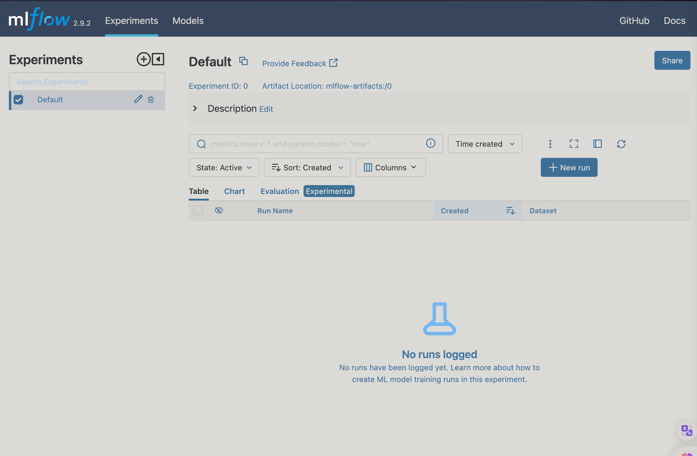

# Getting started with MLflow

Start by creating an environment

```bash
conda create -n exp-tracking-env python=3.9
```

Activate the environment

```bash
conda activate exp-tracking-env
```

Install the required packages

```bash
pip install -r requirements.txt
```

Start the mlflow server with the following command.

```bash
mlflow ui --backend-store-uri sqlite:///mlflow.db
```
This command will start the mlflow server on port 5000. You can access the mlflow server at http://localhost:5000 and we mentioned to mlflow that we want to use sqlite database file mlflow.db which will be used to store the experiment data.




*Now we have to import the mlflow library in our python script*

first we have to set the tracking uri to the sqlite database file and then we have to set the experiment name(if it is already created then it will use that experiment otherwise it will create a new experiment with the given name).

```python
import mlflow
mlflow.set_tracking_uri("sqlite:///mlflow.db")
mlflow.set_experiment("ny_ride_duration")
```

Use the following command to log the parameters, metrics and artifacts by mlflow.

```python
with mlflow.start_run():
    mlflow.set_tag('model', 'Lasso')
    mlflow.set_tag('version', 'v1')
    mlflow.set_tag('develper', 'ram_polisetti')

    alpha = 0.01
    ls = Lasso(alpha)
    ls.fit(X_train, y_train)
    y_pred = ls.predict(X_val)
    
    mlflow.log_param('alpha', 0.01)
    mlflow.log_param('train_data_path', 'green_tripdata_2023-10.parquet')
    mlflow.log_param('val_data_path', 'green_tripdata_2023-11.parquet')
    mlflow.log_metric('rmse', root_mean_squared_error(y_val, y_pred))
    mlflow.sklearn.log_model(ls, 'model')
    
    root_mean_squared_error(y_val, y_pred)
```
