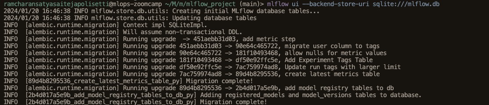
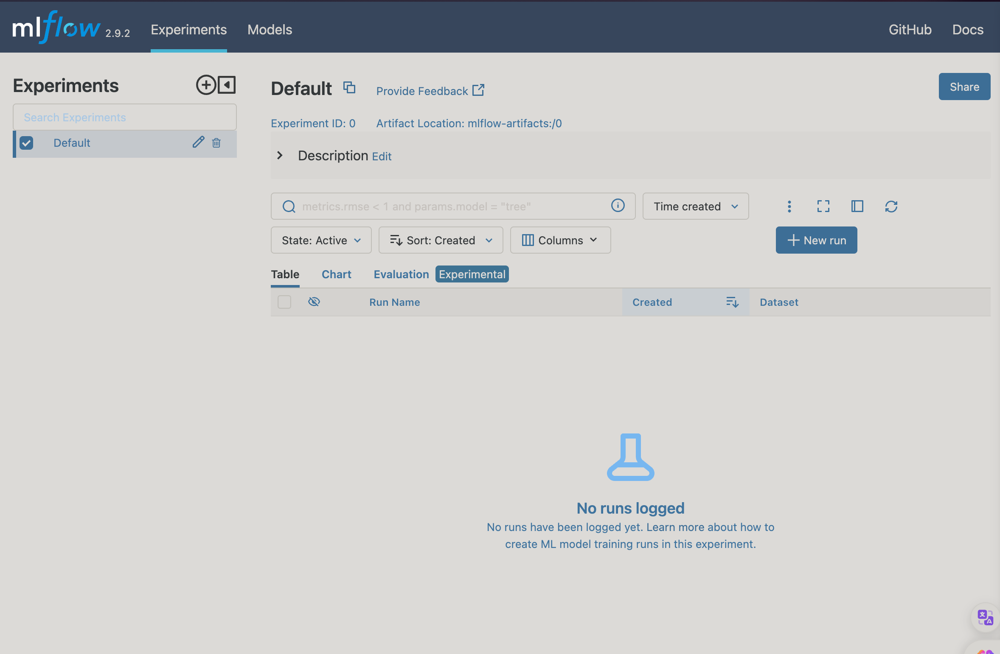

# Getting started with MLflow

Start by creating an environment

```bash
conda create -n exp-tracking-env python=3.9
```

Activate the environment

```bash
conda activate exp-tracking-env
```

Install the required packages

```bash
pip install -r requirements.txt
```

Start the mlflow server with the following command.

```bash
mlflow ui --backend-store-uri sqlite:///nyc_ride_duration.db
```

This command will start the mlflow server on port 5000. You can access the mlflow server at http://localhost:5000 and we mentioned to mlflow that we want to use sqlite database file mlflow.db which will be used to store the experiment data.





*Now we have to import the mlflow library in our python script*

first we have to set the tracking uri to the sqlite database file and then we have to set the experiment name(if it is already created then it will use that experiment otherwise it will create a new experiment with the given name).

```python
import mlflow
mlflow.set_tracking_uri("sqlite:///mlflow.db")
mlflow.set_experiment("ny_ride_duration")
```

Use the following command to log the parameters, metrics and artifacts by mlflow.

```python
with mlflow.start_run():
    mlflow.set_tag('model', 'Lasso')
    mlflow.set_tag('version', 'v1')
    mlflow.set_tag('develper', 'ram_polisetti')

    alpha = 0.01
    ls = Lasso(alpha)
    ls.fit(X_train, y_train)
    y_pred = ls.predict(X_val)
    
    mlflow.log_param('alpha', 0.01)
    mlflow.log_param('train_data_path', 'green_tripdata_2023-10.parquet')
    mlflow.log_param('val_data_path', 'green_tripdata_2023-11.parquet')
    mlflow.log_metric('rmse', root_mean_squared_error(y_val, y_pred))
    mlflow.sklearn.log_model(ls, 'model')
    
    root_mean_squared_error(y_val, y_pred)
```

Hyperparameter tuning with mlflow

```python
import xgboost as xgb

from hyperopt import fmin, tpe, hp, STATUS_OK, Trials
from hyperopt.pyll.base import scope
train = xgb.DMatrix(X_train, label=y_train)
valid = xgb.DMatrix(X_val, label=y_val)


def objective(params):
    with mlflow.start_run():
        mlflow.set_tag('model', 'XGBoost')
        for key, value in params.items():
            mlflow.log_param(key, value)
        mlflow.set_tag('develper', 'ram_polisetti')

        booster = xgb.train(params, 
                            dtrain = train, 
                            num_boost_round=1000,
                            evals=[(valid, 'validation')], 
                            early_stopping_rounds=50
        )
        y_pred = booster.predict(valid)
        rmse = root_mean_squared_error(y_val, y_pred)
        
        # mlflow.log_param('train_data_path', 'green_tripdata_2023-10.parquet')
        # mlflow.log_param('val_data_path', 'green_tripdata_2023-11.parquet')
        mlflow.log_metric('rmse', rmse)
        mlflow.sklearn.log_model(ls, 'model')
        
    return {'loss': rmse, 'status': STATUS_OK}
    
    search_space = {
    'max_depth': scope.int(hp.quniform('max_depth', 4, 100, 1)),
    'learning_rate': hp.loguniform('learning_rate', -3, 0),
    'reg_alpha': hp.loguniform('reg_alpha', -5, -1),
    'reg_lambda': hp.loguniform('reg_lambda', -6, -1),
    'min_child_weight': hp.loguniform('min_child_weight', -1, 3),
    'objective': 'reg:linear',
    'seed': 42
}

best_result = fmin(
    fn=objective,
    space=search_space,
    algo=tpe.suggest,
    max_evals=50,
    trials=Trials()
)

```

### Model Management

- MLflow Models is a convention for packaging machine learning models in multiple formats called "flavors".
- A model can be viewed as a collection of artifacts that can be understood as a single object.
- Each model has a *flavor* which is a way of packaging models.
- MLflow provides a number of built-in flavors for the most common model types.
- You can also define your own flavors.

```python
mlflow.xgboost.load_model(model, 'model')
```

or

```python
with open('model/lasso.bin', 'wb') as f_out:
    pickle.dump((dv, ls), f_out)
mlflow.log_artifact('model', 'model')
```

## Model Registry

```python